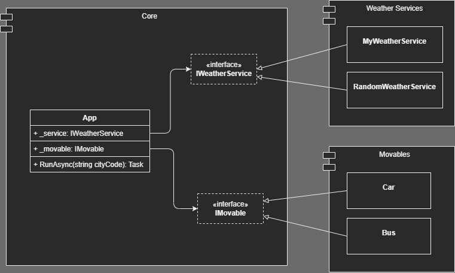

# C# Interface Lecture

[](https://github.com/drumath2237/CSharp-Interface-Lecture/actions/workflows/dotnet.yml)

## About

IwakenLab で行った「軽率に Interface 使ってる？」
というプレゼンのサンプル資料です。
C#のコンソールアプリケーションとして動作します。

天気の状態によって自動運転している交通機関を制御する
都市の中心システムという設定で書いていますが、
ちょっと強引だったかもしれない。

クラス構造は以下のような感じ。



## Environmment

- Windows 10 Home
- .NET 6 Runtime

## Setup & Usage

```bash
# install dependency
dotnet restore

# build app
dotnet build

# run
dotnet run
```
